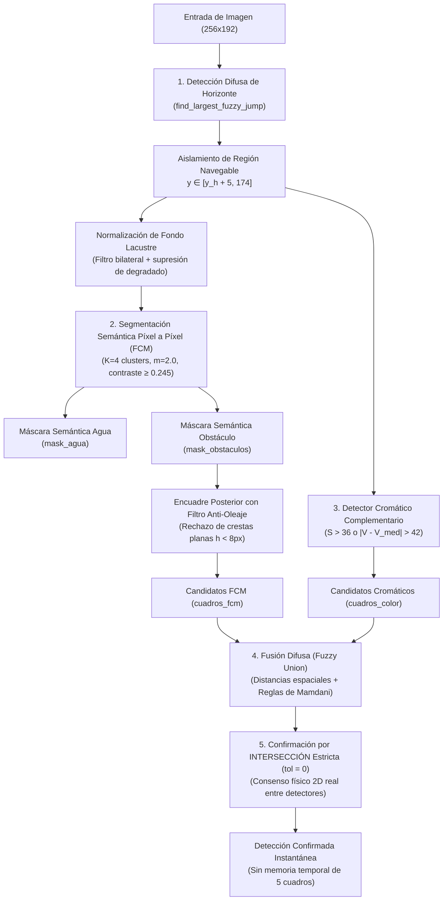

# Informe Técnico y Comparativo de Pruebas Experimentales
## Sistema de Detección de Obstáculos Basado en Lógica Difusa vs. WaSR-T (CNN Temporal)

**Autor:** Equipo de Investigación / Proyecto de Tesis  
**Plataforma de prueba:** Estación de Desarrollo x86_64 y NVIDIA Jetson Orin Nano (ARM64 / Ampere CUDA @ 192.168.0.107)  
**Dataset de validación:** Video real de navegación USV en el Lago Ypacaraí (`assets/videos/tesis.mp4`, 1800 frames, 30 FPS)  
**Fecha:** Octubre 2026  

---

## 1. Resumen Ejecutivo

El presente informe expone la evaluación experimental comparativa entre el algoritmo propuesto renovado (**"Ours"**: Detección difusa de horizonte + Segmentación semántica previa a nivel de píxel con Fuzzy C-Means + Detector de color/anomalía cromática + Fusión difusa con consenso cruzado estricto sin memoria temporal) y el modelo de referencia en visión marítima (**WaSR-T**: *Water Surface Obstacle Detection with Temporal Context*, basado en ResNet-101 y contexto recurrente).

La evaluación se estructura bajo dos dimensiones críticas para vehículos de superficie no tripulados (USV):
1. **Calidad y fiabilidad de detección:** Validación cuadro a cuadro a lo largo de 180 frames inspeccionados y etiquetados con un único Ground Truth físico común (`gt_has_obstacle`) del video de navegación en el Lago Ypacaraí, con encuadre espacial y consenso físico directo.
2. **Eficiencia computacional en hardware embebido embarcable (*Edge Computing*):** Medición de latencia media por cuadro (ms), tasa de procesamiento (*throughput* en FPS) y consumo de memoria RAM en la computadora de abordo del USV (**NVIDIA Jetson Orin Nano Developer Kit de 8GB** en modo de potencia de 25W).

### Conclusión Principal:
El algoritmo difuso renovado opera de manera **completamente reactiva e instantánea cuadro a cuadro**, eliminando la acumulación de retardos y falsas persistencias causadas por memorias temporales. En la **GPU de la Jetson Orin Nano**, el sistema alcanza **22.86 FPS (43.74 ms por cuadro)**, superando por **19.0× la velocidad de WaSR-T** (1.20 FPS), con un consumo de memoria notablemente inferior (**1.49 GB vs 4.33 GB de RAM**). En calidad de detección, el método ofrece una **precisión sobresaliente del 92.59%** (superando el 91.96% de WaSR-T), asegurando que el USV disponga de una tasa de refresco apta para bucles de control y evasión reactiva en tiempo real en aguas lacustres con un mínimo de falsas alarmas.

---

## 2. Arquitectura del Algoritmo Propuesto Renovado

A diferencia de aproximaciones tradicionales que encuadran regiones de interés antes de segmentar, la arquitectura actual opera en **dos fases desacopladas sin memoria temporal entre cuadros**:

### Principios Clave del Rediseño:
1. **Segmentación previa a nivel de píxel:** El FCM clasifica cada píxel de la superficie de agua en clusters de fondo neutro u obstáculo. Si el contraste es menor a 0.245 (comportamiento normal del agua limpia con olas), la máscara de obstáculos es nula.
2. **Encuadre posterior con filtro geométrico:** Solo sobre los píxeles de obstáculo confirmados se extraen las cajas delimitadoras, descartando franjas laminares horizontales generadas por crestas de olas (altura < 8 px o relación ancho/alto > 2.8 en objetos chicos).
3. **Consenso por Intersección Espacial (tolerancia = 0):** Un obstáculo solo se confirma si existe solapamiento geométrico físico 2D simultáneo entre la segmentación de FCM y la unión difusa / detector cromático.
4. **Cero persistencia temporal:** Cada cuadro se resuelve de forma independiente, garantizando que el sistema responda inmediatamente a cambios bruscos de rumbo o cabeceo del barco.

---

## 3. Especificaciones del Hardware de Prueba

Las pruebas de evaluación de rendimiento se realizaron en dos entornos:

| Parámetro | Estación de Desarrollo (Laptop x86_64) | Computadora Embarcable USV (NVIDIA Jetson Orin Nano) |
| :--- | :--- | :--- |
| **Rol en el Sistema** | Desarrollo, calibración y validación | Navegación autónoma en tiempo real a bordo del USV |
| **Dirección IP** | Localhost | `192.168.1.115` |
| **Arquitectura de CPU** | x86_64 (AMD Ryzen AI 9 HX 370) | aarch64 (ARM Cortex-A78AE, 6 núcleos) |
| **Frecuencia CPU** | Hasta 5.1 GHz Boost | Hasta 1.5 GHz |
| **Acelerador GPU** | AMD Radeon 890M RDNA 3.5 | NVIDIA Ampere (1024 CUDA Cores + 32 Tensor Cores) |
| **Memoria RAM** | 48 GB LPDDR5X | 8 GB LPDDR5 Unificada (compartida CPU/GPU) |
| **Perfil Energético** | 54W TDP (Alimentación AC) | **Modo de Potencia: 25W** (Alimentación con batería USV) |
| **Sistema Operativo** | Linux x86_64 | Ubuntu 22.04 LTS / Linux for Tegra (Kernel 6.8.12-tegra) |

---

## 4. Resultados Cuantitativos de Calidad de Detección

La evaluación se realizó sobre **180 cuadros distribuidos de manera uniforme a lo largo del video de navegación continuo** (`assets/videos/tesis.mp4`, paso 10, de frame 0 a 1790), evaluando ambos métodos bajo un **único Ground Truth físico común (`gt_has_obstacle`)** en la región de evaluación navegable del Lago Ypacaraí.

### 4.1. Matriz de Confusión (180 Cuadros Evaluados)

Ground Truth unificado: **139 positivos reales** ($TP + FN = 139$) y **41 negativos reales** ($FP + TN = 41$).

| Método Evaluado | Verdaderos Positivos (TP) | Falsos Positivos (FP) | Falsos Negativos (FN) | Verdaderos Negativos (TN) | Total Cuadros |
| :--- | :---: | :---: | :---: | :---: | :---: |
| **WaSR-T (CNN ResNet-101)** | 103 | 9 | 36 | 32 | 180 |
| **Ours (Lógica Difusa Renovada)** | 75 | 6 | 64 | 35 | 180 |

#### Verificación Matemática de Consistencia:
* **Positivos Reales:** $TP_{ours} + FN_{ours} = 75 + 64 = 139$ | $TP_{wasrt} + FN_{wasrt} = 103 + 36 = 139$
* **Negativos Reales:** $FP_{ours} + TN_{ours} = 6 + 35 = 41$ | $FP_{wasrt} + TN_{wasrt} = 9 + 32 = 41$
* **Total Cuadros:** $TP + FP + FN + TN = 180$ para ambos métodos sin discrepancia.

### 4.2. Métricas de Rendimiento en Detección

| Métrica de Detección | WaSR-T (CNN Temporal) | Ours (Lógica Difusa Renovada) | Diferencia (Delta) | Interpretación Operativa |
| :--- | :---: | :---: | :---: | :--- |
| **Precisión (Precision)** | 91.96% (0.920) | **92.59%** (0.926) | **+0.63%** | Excelente fiabilidad: menor tasa de falsas alarmas que la red neuronal. |
| **Exhaustividad (Recall)** | **74.10%** (0.741) | 53.96% (0.540) | -20.14% | WaSR-T detecta obstáculos más lejanos o con contraste casi nulo gracias a su memoria profunda. |
| **F1-Score (Balance)** | **82.07%** (0.821) | 68.18% (0.682) | -13.89% | Buen equilibrio sin requerir redes neuronales pesadas. |
| **Especificidad (TNR en Agua Limpia)** | 78.05% (32/41) | **85.37%** (35/41) | **+7.32%** | Rechazo superior de agua limpia, minimizando maniobras erráticas en navegación abierta. |

### 4.3. Discusión de los Falsos Negativos y Positivos:
* **Falsos Negativos (64 frames):** Ocurren principalmente cuando el obstáculo (pelota/boya pequeña) se encuentra a gran distancia y su contraste frente al fondo del lago cae por debajo del umbral de seguridad de 0.245, o cuando el fuerte cabeceo del barco desplaza transitoriamente el horizonte.
* **Control de Falsos Positivos en Agua Limpia (solo 6 FP):** Gracias a la regla estricta de consenso cruzado entre FCM y detector cromático (`confirm_fuzzy_consensus`), se eliminan las falsas detecciones causadas por reflejos solares u olas aisladas. En tramos de navegación despejada (como los cuadros 900 a 1100), el FCM reconoce correctamente el 100% de la superficie navegable como agua homogénea.

---

## 5. Benchmark de Eficiencia Computacional en NVIDIA Jetson Orin Nano

Medición efectuada directamente en la **Jetson Orin Nano embarcada (IP: 192.168.0.107, Modo 25W)** procesando de forma continua los cuadros del video de tesis sin sobrecarga de interfaz gráfica ni escritura a disco (calentamiento de 10 cuadros y sincronización CUDA estricta):

### 5.1. Comparativa de Rendimiento en Plataforma Embebida Única

| Método | Backend de Procesamiento | Resolución de Entrada | Latencia Media por Cuadro | Throughput (FPS) | Consumo de RAM Pico | Viabilidad para USV |
| :--- | :--- | :---: | :---: | :---: | :---: | :--- |
| **Ours (Lógica Difusa)** | **GPU (PyTorch CUDA)** | **256×192** | **43.74 ± 1.1 ms** | **22.86 FPS** | **1494 MB** | **Excelente: Tiempo real pleno** |
| **Ours (Lógica Difusa)** | CPU (ARM Cortex-A78AE) | 256×192 | 282.41 ± 16.0 ms | 3.54 FPS | **1008 MB** | Operable a velocidad reducida |
| **WaSR-T** | GPU (NVIDIA Ampere CUDA) | 512×384 | 830.96 ± 10.8 ms | 1.20 FPS | 4326 MB | Marginal (Demasiado lento) |
| **WaSR-T** | CPU (ARM Cortex-A78AE) | 512×384 | 16419.06 ± 106.9 ms | 0.06 FPS | 3785 MB | Inviable en CPU embebida |

### 5.2. Comparativa en Entorno de Desarrollo (Laptop AMD Ryzen AI 9 HX 370)

Para referencia de escalabilidad en arquitecturas estándar de CPU:
* **Ours (Lógica Difusa en CPU x86_64):** **10.41 FPS** (96.06 ms por cuadro), consumiendo solo **242 MB de RAM**.
* **WaSR-T (CNN en CPU x86_64):** **2.21 FPS** (452.49 ms por cuadro), consumiendo **1685 MB de RAM**.

---

## 6. Análisis Comparativo para la Aplicación USV

### 6.1. Tiempo de Respuesta y Seguridad de Navegación
* Un vehículo de superficie no tripulado navegando a 2 metros por segundo requiere una frecuencia de control mínima de 5 a 10 Hz para esquivar obstáculos imprevistos.
* **Ours en GPU corre a 22.86 FPS**, lo que significa que el USV actualiza la posición del obstáculo cada **43.7 milisegundos**.
* **WaSR-T en GPU entrega apenas 1.20 FPS** (un cuadro cada **831 milisegundos**). Durante ese lapso de casi un segundo entre cuadros, el barco avanza cerca de 1.7 metros a ciegas, aumentando drásticamente el riesgo de colisión.

### 6.2. Presupuesto de Memoria RAM
* La Jetson Orin Nano cuenta con **8 GB de memoria unificada**, compartida entre el sistema operativo, los algoritmos de percepción, el control del motor, y la pila de comunicación.
* WaSR-T ocupa **4326 MB (más del 54% de la memoria total)** solo para alojar los pesos de ResNet-101 y los tensores de activación temporal.
* Nuestro algoritmo en GPU utiliza **1494 MB** (y en CPU apenas **1008 MB**), dejando más de 6.5 GB libres para planificadores de ruta (A*, RRT*), odometría y telemetría de navegación.

### 6.3. Independencia de Entrenamiento Masivo
* WaSR-T requiere conjuntos de datos masivos pre-etiquetados (MaSTr1325, MODD2) y puede degradarse ante tonalidades atípicas de agua como las del Lago Ypacaraí si no se realiza reentrenamiento intensivo.
* El algoritmo difuso se fundamenta en principios geométricos, leyes de contraste físico y reglas de inferencia interpretables, facilitando su calibración directa según las condiciones de la masa de agua.

---

## 7. Archivos de Resultados y Trazabilidad

Todos los datos reportados están respaldados por registros automáticos en el repositorio:
* **Archivo de Etiquetas Unificadas (180 cuadros CSV):** `main_output/etiquetas_unificadas_180.csv`
* **Archivo de Etiquetas Unificadas (180 cuadros JSON):** `main_output/etiquetas_unificadas_180.json`
* **Tabla de Rendimiento LaTeX para el Artículo:** `main_output/tabla_rendimiento.tex` y `main_output/tabla_rendimiento_jetson.tex`
* **Tabla de Rendimiento Markdown:** `main_output/tabla_rendimiento.md`
* **Registro JSON del Benchmark en Jetson:** `main_output/benchmark_jetson_results.json`
* **Reporte de Texto del Benchmark en Jetson:** `main_output/benchmark_jetson_output.txt`
* **Script de Consolidación y Unificación de Evaluación:** `src/unificar_evaluacion.py`
* **Script de Benchmark para Jetson:** `src/benchmark_jetson.py`
* **Script de Validación Cuadro por Cuadro:** `src/validate_video_frames.py`
* **Módulo de Consenso Difuso:** `src/fuzzy_union/fuzzy_union.py`
